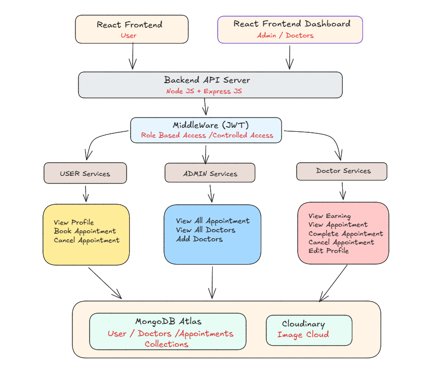

# Medi-Link - Doctor Appointment Web App

**Medi-Link** is a full-stack healthcare web application built with the **MERN stack** (MongoDB, Express.js, React.js, and Node.js) to simplify doctor appointment management. The platform features three dedicated dashboards—**Patient**, **Doctor**, and **Admin**—each designed with role-specific functionalities. Patients can book appointments, make secure online payments, and access digital prescriptions, while doctors can efficiently manage appointments and generate downloadable digital prescriptions. With secure authentication, cloud storage integration, and a responsive user interface, **Medi-Link** delivers a seamless and modern healthcare experience.

## 🛠️ Tech Stack

- **Frontend**: React.js
- **Backend**: Node.js, Express.js
- **Database**: MongoDB Atlas
- **Authentication**: JSON Web Token (JWT)
- **Payment Gateway**: RazorPay

## 🔑 Key Features

- 🔐 **Three-Level Authentication System** for Patients, Doctors, and Admins with secure login and access control.

- 👤 **Patient Dashboard** to book, cancel, reschedule, and manage doctor appointments easily.

- 🩺 **Doctor Dashboard** with appointment management, earnings overview and profile updates.

- 🛠️ **Admin Panel** to manage doctors, appointments, patients.

- 🔎 **Search & Filter Doctors** by specialty with detailed doctor profiles.

- 👨‍⚕️ **Doctor Profile Management** including qualifications, experience, fees, address, and description.

- 👤 **User Profile Management** with editable personal details and profile picture upload.

- 📊 **Admin Analytics Dashboard** showing total doctors, patients, appointments, earnings, and recent bookings.

- 💳 **Integrated Razorpay payment** gateway for secure and seamless online appointment payments.

- 📄 **Digital prescriptions** doctors can create, preview, and securely upload digital prescriptions that patients can download anytime.

---

# 🏗️ System Architecture




---

## 🌐 Project Setup

To set up and run this project locally:

### 1. Clone the Repository

```bash
git clone https://github.com/nikhilughade562-dev/MEDI-LINK.git

cd MEDI-LINK
```

### 2. Install Dependencies

#### Admin

```bash
cd admin
npm install
npm run dev
```

#### Server

```bash
cd server
npm install
npm run dev
```

#### Client

```bash
cd client
npm install
npm run dev
```

### 3. Environment Variables

Create a `.env` file in the root directory of the `server` folder and add the following:

```env
MONGODB_URI=your_mongodb_connection_string
PORT=5000
CLOUDINARY_NAME=your_cloudinary_name
CLOUDINARY_API_KEY=your_api_key
CLOUDINARY_SECRET_KEY=your_secret_key
JWT_SECRET=your_jwt_secret
ADMIN_EMAIL=Admin_email
ADMIN_PASSWORD=Admin_password
RAZORPAY_KEY_ID=your_razorpay_key
RAZORPAY_KEY_SECRET=your_razorpay_secret_key
CURRENCY="INR"
```

Create a `.env` file in the root directory of the `client and Admin` folder and add the following:

```env
VITE_BACKEND_URL=http://localhost:5000
VITE_RAZORPAY_KEY_ID=your_razorpay_key
```

## 👨‍💻 Author

### Nikhil Ughade

## 📜 License

This project is licensed under the **MIT License**.